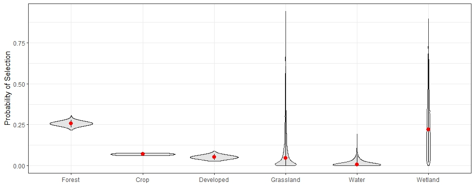

\begin{center}
Please reach out to me at marco.salvo@umconnect.umt.edu with any issues, bugs, or update ideas
\end{center}

## The JAGS Prediction Function

Below is a guide and tutorial for using my JAGS prediction function,
which allows the automated prediction of simulation results from JAGS models.

This function was built to be used with output from the jagsUI package, so I'm
unsure how it would work with Rjags or other packages, but as long as you have 
simulation data outputs, it should work.

Let's dig into the function with the whole function being below:

```{r predict function, message = FALSE}
# predict from jags output
jags.predict <- function(intercepts,
                         slope.coefficients,
                         exp.cov.values,
                         credible.intervals = c(0.025, 0.5, 0.975),
                         res = 100,
                         link.function,
                         lognormal.sd,
                         covariate.type = "continuous"
){
  #extract the number of iterations from your simulated intercepts
  iters <- length(intercepts)
  
  ### Setup Data:
  
  #contin
  if(covariate.type == "continuous"){
    #create sequences of your covariate values
    for(ixi in 1:length(exp.cov.values)){ #for every covariate value
      if("numeric" %in% class(exp.cov.values[[ixi]])){ # if it is numeric:
        if(length(exp.cov.values[[ixi]]) == 1){ #if expected value is length 1, repeat it up the times of res
          exp.cov.values[[ixi]] <- rep(exp.cov.values[[ixi]], times = res)
        } else if(length(exp.cov.values[[ixi]]) == 2){ #if expected values are length 2 (a range), create a sequence of times of res
          exp.cov.values[[ixi]] <- seq(exp.cov.values[[ixi]][1], 
                                       exp.cov.values[[ixi]][2],
                                       length.out = res)
        } else { #if a covariate value is not length 1 or 2, give an error
          stop("Expected covariate values must be of length 1 or 2")
        }
        
      }
    }
  } else if(covariate.type == "categorical"){
    
    #check if the name of each list item is "category"
    is.category <- sapply(exp.cov.values, function(x) x == "category")
    
    #for every covariate value
    for(ixi in 1:length(exp.cov.values)){ 
      if(is.category[ixi] == T){ #if it is categorical
        exp.cov.values[[ixi]] <- rep(0, times = length(exp.cov.values[is.category]) + 1) #create a sequence of 0's which is 1+length of the number of categories
      } else if(is.category[ixi] == F){ #else if it's continuous
        if(length(exp.cov.values[[ixi]]) == 1){
          exp.cov.values[[ixi]] <- rep(exp.cov.values[[ixi]], 
                                       times = length(exp.cov.values[is.category]) + 1) #repeat the means the same number of times as the number of categories
        } else { #no varying values within a categorical prediction (yet)
          stop("Current version does not account for interactions, set continuous covariates to their mean value")
        }
      }
    }
    
    #Fill in 1's in every 0 sequence
    for(i in seq_along(exp.cov.values)){
      if(i == 1){pos <- 2} #set position index to 2 for the first value
      
      if (all(exp.cov.values[[i]] == 0)) {  # Check if the vector is all zeros
        if(i != 1){pos <- pos + 1} #add a 1 to the position index
        exp.cov.values[[i]][pos] <- 1 #set the position value to 1
      }
    }
    
    #set res
    res <- length(exp.cov.values[is.category]) + 1
    
  } else {stop("covariate.type must be one of 'continuous' or 'categorical'.")}
  
  
  #create a matrix for:
  pred.mat <- matrix(NA, iters, res) #predicted values
  pred.cred <- matrix(NA, res, length(credible.intervals)) #predicted median and credible intervals
  
  # Get your estimates
  for(jlv in 1:res){ # for all resolutions:
    
    parameter.values <- list() #initialize list to store parameter values in
    for(ixi in 1:length(exp.cov.values)){ #for all covariates in the model:
      
      if("numeric" %in% class(exp.cov.values[[ixi]])){ #different indexing for vectors and matrices
        parameter.values[[ixi]] <- slope.coefficients[[ixi]] * exp.cov.values[[ixi]][jlv]#get the product of the slope and the covariate value
      } else if("matrix" %in% class(exp.cov.values[[ixi]])){
        parameter.values[[ixi]] <- slope.coefficients[[ixi]] * exp.cov.values[[ixi]][,jlv]#get the product of the slope and the covariate value
      } else {
        stop("expected values must be a numeric vector or a expected.response.matrix matrix derived from this function")
      }
      
      
      if(ixi == 1){ #for the first value, add the intercepts and the first covariate term
        pred.mat[,jlv] <- intercepts + parameter.values[[ixi]]
      } else { #for all other values, add them to the current matrix column to get the complete expected value based on a normal distribution
        pred.mat[,jlv] <- pred.mat[,jlv] + parameter.values[[ixi]]
      } 
      
    }
    
    #If the model is not following a normal distribution:
    if(link.function == "log"){ #for log links
      pred.mat[,jlv] <- exp(pred.mat[,jlv])
    } else if(link.function == "lognormal"){ #for log-normal links
      pred.mat[,jlv] <- rlnorm(iters, pred.mat[,jlv], lognormal.sd)
    } else if(link.function == "logit"){ # for logit link
      pred.mat[,jlv] <- exp(pred.mat[,jlv])/(1+exp(pred.mat[,jlv]))
    }
    
    #get predicted credible intervals
    pred.cred[jlv,] <- quantile(pred.mat[,jlv], credible.intervals)
  }
  
  #melted observations for graphing
  melted.obs <- melt(pred.mat); names(melted.obs) <- c('iteration','cov','response')
  
  return(list(expected.cov.values = exp.cov.values,
              expected.response.matrix = pred.mat,
              expected.quantiles = pred.cred,
              plotting.data = melted.obs))
  
}
```


### Arguements

There's obviously a lot that goes into the function so let's just understand the
steps that go into it. First let's start with an overview of the arguments:


     
**intercepts:** The simulated model intercepts. Should be a numeric vector

**slope.coefficients:** The simulated slope coefficients of all slope parameters
                   included in your model. This should be a list of numeric 
                   vectors, even if your model only has one slope coefficient.
                   
**exp.cov.values:** The covariate values to be predicted over. This should be a list
                of the same length of slope.coefficients with values in the same order 
                with their corresponding slope coefficients. 
                For covariate.type = "continuous", the items in list should either be a single numeric value, 
                which will be repeated the number of times in res, or a numeric
                vector of length 2 which represent the minimum and maximum
                values of a covariate which you want to predict over and will
                be turned into a sequence the length out of res.
                For covariate.type = "categorical",the list items should either be a 
                character vector named "category" for the categorical slope positions, or a single numeric
                value either representing the mean of any continuous covariate or 0 for categorical covariates 
                not being predicted over (say, if you have two different categorical groupings in your 
                model, such as land cover and time of day [day vs. night], but only want to predict land cover,
                the positions with the slope coefficient for night would = 0).
               
**credible.intervals:** A numeric vector of credible intervals to be predicted over.
                    Default is median and 95% credible intervals.
                    
**res:** The desired resolution of your output. The default is 100, which usually
     produces good graphs

**link.function:** The link function used in your model as a character. Currently 
               supported link functions include normal ("identity"), 
               log ("log"), logit ("logit"), and lognormal ("lognormal").
                    
**lognormal.sd:** Only needed for link.function = "lognormal", a numeric vector of 
              simulated standard deviation values from your model.

**covariate.type:** Is the covariate being predicted "continuous" (default) or "categorical"

### Outputs

The output from these models is composed of a list with four items:

**expected.cov.values:** The full sequence of all expected covariate values fed to the model. Listed in the same order as the list given to *exp.cov.values* argument of the function.

**expected.response.matrix:** The matrix of expected responses for each iteration for each of the covariate values provided based on your model formula.

**expected.quantiles:** The expected value of each quantile given in the *quantiles* argument at each expected covariate value.

**plotting.data:** A melted matrix which contains the values for plotting a smooth scatter plot.
"iterations" is the iteration number of the data, "cov" is the specific covariate index location, and "response" is the expected response value for that iteration and covariate index value

### The Inner Workings

Now that we understand the arguments and outputs of the function, let's break down what is actually going on inside of this function.

1) The values provided to the *exp.cov.values* are made into a sequence which is the length of the value provided to *res* for continuous covariates. If only one value is provided, it is repeated that many times. If you provide the *expected.response.matrix* output of this function to the *exp.cov.values* for structural equation modeling predictions, it will keep the matrix as is. For categorical covariates, it makes a sequence of 0's which is the length of the number of categories where one value in the sequence equals 1 in each category to make a prediction for each category. The position of the one is different for each category to ensure there is no overlap.

2) For your model, every slope coefficient gets multiplied by each value of it's corresponding sequence of covariate values. Those all get added to the intercept, and then transformed using your chosen link function. This happens for every iteration to create a predicted matrix of response values.

3) We then take the predicted values, and get the quantiles for the response at each covariate value.

4) We then melt the predicted response matrix into a 3 column matrix found in *plotting.data* for easier use in plots

It's really not that hard, but also simplifies this task a ton!


### Examples

Now lets show how it can be used:

Let's load the packages we'll need for this below:
```{r libraries, warning=FALSE}
library(jagsUI)
library(reshape2)
```


First let's simulate some simple data predicting the response of deer density to wolf density, and vegetation density to deer density. This simulation and JAGS code is borrowed from a structural equation modeling class taught by Dr. Thomas Riecke:
```{r simulate}
#set seed
set.seed(14763)

# 100 sites
n <- 100

#wolf density
wolf <- rlnorm(n, 0.35, 0.75)

#Deer density
alpha0 = 3.75
alpha1 = -0.225
deer <- rlnorm(n, alpha0 + alpha1 * wolf, 0.25)

#Vegetation density
beta0 <- 0
beta1 <- -0.125
veg <- rlnorm(n, beta0 + beta1 * deer, 0.25)

par(mfrow = c(2,2), mar = c(5.1,5.1,2.1,2.1))
hist(wolf, xlab = 'Wolf density', 
     breaks = 25, main = NULL)
plot(deer ~ wolf, ylab = 'Deer density', xlab = 'Wolf density')
plot(veg ~ deer, ylab = 'Browse/vegetation density', xlab = 'Deer density')
plot(veg ~ wolf, ylab = 'Browse/vegetation density', xlab = 'Wolf density')

```


We can see with our simulated data, there is a clear relationship between wolves, deer, and vegetation. So let's model this in a structural equation model in JAGS using a path anlaysis, since wolves likely don't have a direct effect on vegetation, but affect it through the regulation of deer density.

We'll build a models where:

1) deer ~ wolves
2) veg ~ deer

We'll use a lognormal distribution since that's how we simulated our data and vague priors.

```{r model write, eval = FALSE}
sink("m_path.jags")
cat("
    model {

    # priors for everything assigned in a loop to minimize unnecessary coding mistakes
    for (j in 1:2){
      alpha[j] ~ dnorm(0, 0.1)
      beta[j] ~ dnorm(0, 0.1)
      sigma[j] ~ dgamma(1,1)
      tau[j] = 1/(sigma[j] * sigma[j])
    }

    for (i in 1:n){
      deer[i] ~ dlnorm(alpha[1] + alpha[2] * wolf[i], tau[1])
      veg[i] ~ dlnorm(beta[1] + beta[2] * deer[i], tau[2])
    }

    }
    ",fill = TRUE)
sink()
```


Next we'll run our model:
```{r model run, eval = FALSE}
jags.data <- list(n = n, wolf = wolf, deer = deer, veg = veg)
inits <- function(){list()}  
parameters <- c('alpha','beta','sigma')

# number of chains (nc), thinning rate (nt), number of iterations (ni), and number to burn-in (nb)
nc <- 4
nt <- 10
ni <- 20000
nb <- 10000

model <- jags(jags.data, inits, parameters, "m_path.jags", parallel = T, 
              n.chains = nc, n.thin = nt, n.iter = ni, n.burnin = nb)

```
```{r load in model, echo=FALSE}
model <- readRDS("JAGS_example_model.rds")
```

We can see the model results below:
```{r}
print(model)
```

Now that we've gone through those steps, let's predict some data with our function. We'll start by predicting the effect of wolf density on deer density.

First let's extract the values we need from the model:
```{r set predict values}
m.iters <- length(model$sims.list$alpha[,1]) #number of model iterations
m.intercepts <- model$sims.list$alpha[,1] #The intercepts of our model
m.slopes <- list(model$sims.list$alpha[,2]) #slopes of our model, remember, this MUST be in a list format
m.covs <- list(c(min(wolf), max(wolf))) #The range of covariate values to predict across, also MUST be a list
m.sd <- model$sims.list$sigma[,1] #The simulated standard deviations, needed for the lognormal distribution
```

And now lets run the predictions:
```{r predict}
wolfdeer.predict <-
jags.predict(intercepts = m.intercepts,
             slope.coefficients = m.slopes,
             exp.cov.values = m.covs,
             credible.intervals = c(0.025,0.5,0.975),
             res = 100,
             link.function = "lognormal",
             lognormal.sd = m.sd)
```

Lets examine the outputs from this.

First we have the plotting data:
```{r}
wolfdeer.predict$plotting.data[1:10,]
```
Next we have the expected covariate values, which you can see have been transformed to a numeric vector of 100 values
```{r}
wolfdeer.predict$expected.cov.values
```
Next we have the prediction matrix. I've shortened the output so it doesn't take up this whole pdf, but you can see it has the same dimensions as the number of iterations and the resolution provided to jags.predict.
```{r}
print(dim(wolfdeer.predict$expected.response.matrix))
wolfdeer.predict$expected.response.matrix[1:10, 1:4]
```
And finally we have our quantile values which are in the same order we provided to the quantiles arguement in jags.predict.
```{r}
wolfdeer.predict$expected.quantiles[1:10,]
```
## JAGS Prediction Plotting Function

Now we can easily use this data to make a nice plot of the expected relationship between wolves and deer given our model. I've also made a handy function for this, **plot.jags.predict**!
```{r}
plot.jags.predictions <- 
  function(plotting.data, 
           expected.covariate.values,
           quantiles,
           x.lab,
           y.lab,
           covariate.type = "continuous",
           category.names){
    
    if(covariate.type == "continuous"){
      
      smoothScatter(plotting.data$response ~ expected.covariate.values[plotting.data$cov],
                    las = 1, nrpoints = 0,
                    ylab = y.lab,
                    xlab = x.lab)
      lines(quantiles[,2] ~ expected.covariate.values, lty = 1, lwd = 3, col = 'white')
      lines(quantiles[,1] ~ expected.covariate.values, lty = 2, lwd = 3, col = 'white')
      lines(quantiles[,3] ~ expected.covariate.values, lty = 2, lwd = 3, col = 'white')
      
    } else if(covariate.type == "categorical"){
      
      plot.df <- 
        data.frame(category = category.names,
                   cov = 1:nrow(quantiles),
                   low.CI = quantiles[,1],
                   median = quantiles[,2],
                   high.CI = quantiles[,3])
      
      ggplot() + 
        geom_violin(data = plotting.data, aes(as.factor(cov), response), bw = 0.01, fill = "gray90") + 
        geom_linerange(data = plot.df, aes(x = as.factor(cov), ymin = low.CI, ymax = high.CI), size = 0.7) +
        geom_point(data = plot.df, aes(as.factor(cov), median), color = "red", size = 2.5) +
        theme_bw() +
        scale_x_discrete(name = waiver(), labels = category.names) +
        ylab("Probability of Selection") +
        xlab("")
      
    } else {
      stop("covariate.type must be one of 'continuous' or 'categorical'")
    }
    
  }
```

Let's go over the arguments for this function:

**plotting.data:** The *plotting.data* data frame from jags.predict

**expected.covariate.values:** The expected covariate values which you will be plotting against. Only needed for covariate.type = "continuous". Make sure this is one of the items from the *expected.cov.values* list from jags.predict, and not the list itself.

**quantiles:** The *expected.quantiles* matrix from jags.predict. Make sure this is a matrix with length 3, ordered so column 1 is the lower credible interval, column 2 is the median (0.5), and column 3 is the upper credible interval.

**x.lab:** Character label for the x-axis

**y.lab:** Character label for the y-axis

**covariate.type:** Is the covariate being predicted "continuous" (default) or "categorical"

**category.names** The names of the continuous covariates in a character vector of the same order as your slopes list so labels can be correct. The first label should be for the intercept group. Only needed for covariate.type = "categorical".


The output of this is a nice simple plot:
```{r}
plot.jags.predictions(plotting.data = wolfdeer.predict$plotting.data,
                      expected.covariate.values = wolfdeer.predict$expected.cov.values[[1]],
                      quantiles = wolfdeer.predict$expected.quantiles,
                      x.lab = "Wolf density",
                      y.lab = "Expected deer density")
```
The plot shows our simulated density in blue as the background, with a white solid line for the median and dashed lines for our upper and lower 95% credible intervals. Even if you dont want this exact plot, take a look at hat the inside of the function takes for plotting to understand how to plot based on jags.predict.

Now we'll see how to use predictions from one response of a model to inform predictions from a model in a path analysis framework.

We'll now predict vegetation as a function of our predicted deer values given our range of wolf densities. First let's extract what we need from the model, then run jags.predict
```{r predict2}
#same iterations as before
m2.intercepts <- model$sims.list$beta[,1]
m2.slopes <- list(model$sims.list$beta[,2])
m2.covs <- list(wolfdeer.predict$expected.response.matrix) #Notice here how instead of feeding a vector of length two, we're feeding the model the entire prediction matrix from the wolfdeer.precit object
m2.sd <- model$sims.list$sigma[,2]

deerveg.predict <-
jags.predict(intercepts = m2.intercepts,
             slope.coefficients = m2.slopes,
             exp.cov.values = m2.covs,
             res = 100,
             link.function = "lognormal",
             credible.intervals = c(0.05,0.5,0.95),
             lognormal.sd = m2.sd)
```


Now to plot for a path analysis my plot.jags.predict function doesn't work in its current form (future thing to be worked on), so instead we'll plot this manually to determine the effects of wolves on vegetation.
```{r}
smoothScatter(deerveg.predict$plotting.data$response ~ wolfdeer.predict$expected.cov.values[[1]][deerveg.predict$plotting.data$cov],
              las = 1, nrpoints = 0,
              ylab = 'Expected density of vegetation',
              xlab = 'Density of wolves')
lines(deerveg.predict$expected.quantiles[,2] ~ wolfdeer.predict$expected.cov.values[[1]], lty = 1, lwd = 3, col = 'white')
lines(deerveg.predict$expected.quantiles[,1] ~ wolfdeer.predict$expected.cov.values[[1]], lty = 2, lwd = 3, col = 'white')
lines(deerveg.predict$expected.quantiles[,3] ~ wolfdeer.predict$expected.cov.values[[1]], lty = 2, lwd = 3, col = 'white')

```

Awesome, we can now see how vegetation density is predicted to change as wolf density increases. 

## Categorical Example

Below is example code of how this would work for a categorical model.

First let's look at the model structure. This is a model to predict deer resource selection as a function of land cover classes summarized from the National Land Cover Dataset and distance from road:
```{r, eval=FALSE}
sink(file = "data/deer_rsf.jags")
cat("
    model {
    for(j in 1:7){
      beta[j] ~ dnorm(0, 0.1)
    }
    
    for(i in 1:n){
      logit(use[i]) <- beta[1] + beta[2] * crop[i] + beta[3] * developed[i] +
                       beta[4] * grassland[i] + beta[5] * water[i] + beta[6] * wetland[i] +
                       beta[7] * road.dist[i]
                      
      y[i] ~ dbern(use[i])
    }
    
    }
", fill = TRUE)
sink()
```


For the sake of brevity, I'm not going to run the model here, but instead show an example of how the functions would work to make categorical predictions.

The key difference is in setting up the expected covariate values list, where every categorical expected covariate is labeled "category". Continuous covariates should be held at their mean. Category name labels start with the intercept group and otherwise stay in the same order as your slope list.
```{r, eval=FALSE}
m.intercepts <- model$sims.list$beta[,1]

m.slopes <- list(model$sims.list$beta[,2],
                 model$sims.list$beta[,3],
                 model$sims.list$beta[,4],
                 model$sims.list$beta[,5],
                 model$sims.list$beta[,6],
                 model$sims.list$beta[,7])

m.covs <- list("category", 
               "category", 
               "category", 
               "category", 
               "category", 
               mean(deer.final.df$road.dist))

m.category.names <- c("Forest", "Crop", "Developed", "Grassland", "Water", "Wetland")

```

You would then put everything into the functions below just like before and get a plot as output:
```{r, eval = F}
m.land.predict <-
  jags.predict(intercepts = m.intercepts,
               slope.coefficients = m.slopes,
               exp.cov.values = m.covs,
               link.function = "logit",
               covariate.type = "categorical")

plot.jags.predictions(plotting.data = m.land.predict$plotting.data,
                      quantiles = m.land.predict$expected.quantiles,
                      x.lab = "",
                      y.lab = "Probability of Selection",
                      covariate.type = "categorical",
                      category.names = m.categroy.names)
```


